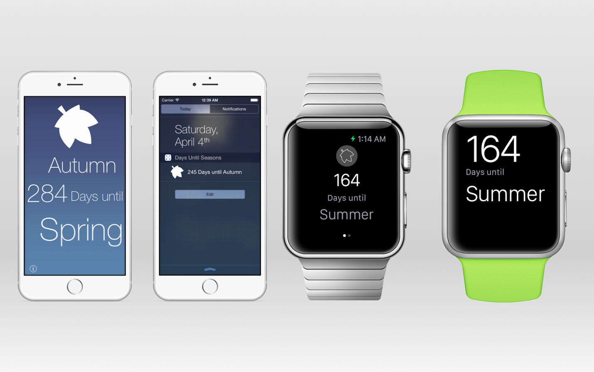

#Days Until Seasons

Days Until Seasons is a project that I started for some personal reasons.
Sometimes I need to know what is the current season and what is the next, for take care of bonsais and others plants that I really love. For a healthy growth we need to know the season to apply fertilizer correctly.

So I think the focus on this app is show the information on the **Widget** and **Apple Watch** Screen. And that is what I made.

**The app will be on Apple store after the apple review. I will put the link in this page when they aprove it.**

### Technology used in this project

* Writing with Obj-c and Swift
*	Apple Watch
	*	Page-Based Interface
	*	Glance
*	Today Extension (Widget)
*	Create our own Cocoa Touch Framework
*	Core Location (we get the user Localization for defining the current Hemisphere)
*	Internationalization ( as soon as possible )
*	Unit Tests
*	Google Analitycs ( as soon as possible )
*	Facebook Parse and Analitycs ( as soon as possible )
*	CI with Travis ( as soon as possible )
*	Sketch 3 Design ( all arquives from sketch 3 is inside the project )

### Studying about Seasons

To create the app I searched about some information about the World's Seasons and I find some great things.
World's Seasons can be divided into two types: *Meteorological* and *Astronomical*.
Our app will work with **Meteorological Seasons** and with distincting of which *hemisphere the user will be*. Yes, each hemisphere has your on Meteorological seasons. So, if the users location is on Northern Hemisphere, we will set the correctly seasons for that location.

##Contact

Follow @fabintk on Twitter or mail me at fna.contact@gmail.com.

##License

Days Until Seasons is available under MIT licence. See the LICENSE file for more info.
